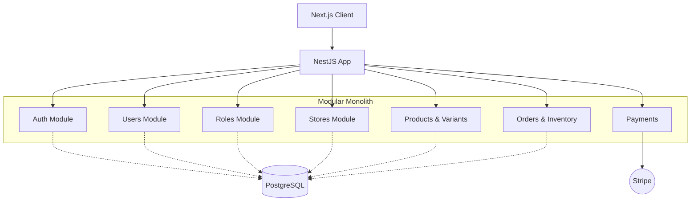

# Arquitectura: Modular Monolith

## Concepto General
El proyecto sigue el patrón **Modular Monolith** donde toda la aplicación backend corre en un solo servicio (Node.js), pero está estrictamente particionada en módulos independientes a nivel de código (`users`, `stores`, `products`, `orders`, etc.).

### Diagrama General

```text
[ Client (Next.js) ] -> HTTP/REST -> [ API Gateway / NestJS App ]
```



## Patrones Utilizados
1. **Repository Pattern (Opcional pero Recomendado):** Para separar la lógica compleja de base de datos del caso de uso principal en los Services, sobre todo al tratar con Prisma transaccional (ejemplo: inventario).
2. **DTOs (Data Transfer Objects):** Validación dura en el borde de la aplicación con `class-validator`.
3. **Guards & Roles (RBAC):** Restricciones de rutas por jerarquía de roles (`Customer`, `Store Admin`, `Super Admin`).
4. **Tenant Isolation por `store_id`:** El código debe tratar el `store_id` como un tenant identifier incrustado en todas las consultas de módulo comercial (Productos, Órdenes, etc.).
